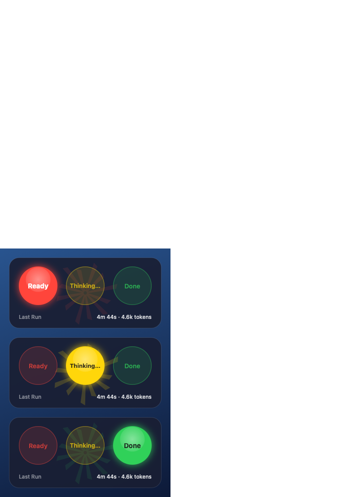

# Code Traffic Light 🚦

A floating macOS status widget for **Claude Code**. It shows what Claude Code is doing right now, as a horizontal traffic light styled like the built-in macOS desktop widgets: red while Claude waits for you, yellow while it works, green (with a sound) when it has finished. The footer shows a summary of the last run, the same way the Claude app shows it.

<p align="center"></p>

## What you see

| Light | Label | When |
|---|---|---|
| 🔴 Red | `Ready` | Claude is waiting for you. While it waits for you to approve an action: `Approve?` |
| 🟡 Yellow (pulsing) | `Thinking…` | Claude is thinking, running tools or processing results. The watermark logo "breathes" and slowly spins |
| 🟢 Green | `Done` | Claude finished its reply. A sound plays, the light stays green for **10 seconds**, then returns to red |

- **Last Run** – `4m 44s · 4.6k tokens`: how long the last run took (from your prompt to Claude's last message) and how many output tokens Claude generated.
- **Watermark** – a soft sparkle, very translucent, tinted with the colour of the active light.
- **Menu bar dot** – same colour as the traffic light, with a menu that also shows the context-window usage (`Context: 365k / 1M (36%)`).
- **Sleep mode** – after 10 minutes without any Claude activity the widget dims so it does not catch your eye. Hovering over it, or any new event, wakes it up.

Several Claude Code windows at once? The widget merges them: if any session is working → yellow; otherwise, if any session finished within the last 10 seconds → green; otherwise → red.

## How it works

Three parts, all local to your Mac:

1. **Claude Code hooks** – `install.sh` adds commands to `~/.claude/settings.json` that run `traffic-light-hook.sh` on the events
   `SessionStart`, `UserPromptSubmit`, `PreToolUse`, `PostToolUse`, `PreCompact`, `Notification`, `Stop` and `SessionEnd`.
2. **State files** – the script writes one small JSON file per session to `~/.claude/traffic-light/sessions/<session_id>.json`, holding the state (`ready` / `working` / `done`), the label, the pid of the Claude Code process and the last-run figures.
3. **The app** – `Code Traffic Light.app` (Swift/AppKit, no dependencies) polls those files 20 times a second and draws the traffic light.

### Where the Last Run figures come from

Claude Code stores every conversation in a transcript (a JSONL file), and every message from Claude carries the `usage` returned by the API. The hook script:

- on `UserPromptSubmit` remembers the transcript line where the run starts;
- on `Stop` reads the messages appended since then: **duration** = from the prompt's timestamp to the last message; **tokens** = the sum of `output_tokens` (de-duplicated by message id); **Context** = `input + cache_read + cache_creation` of the last API call, which is exactly the number the Claude app shows as "tokens used".

Nothing is summed across calls for the cache, so the figures match what you see in the app.

### Why the colour changes without an event

- Green → red after 10 seconds: the app measures the age of the `done` file.
- A `working` file whose Claude Code process no longer exists (Claude Code quit without `SessionEnd`), or that has not been updated for 15 minutes, is ignored, so the light cannot get stuck on yellow.
- Files older than 24 hours are deleted automatically.

## Requirements

- macOS 13 or later (Apple Silicon or Intel).
- Xcode Command Line Tools, for `swiftc`: `xcode-select --install`.
- `jq` – included with macOS 15 and later. If missing: `brew install jq`.
- Claude Code (the CLI, or through the Claude desktop app).

## Install

```bash
git clone https://github.com/Shadi-Kharbat/code-traffic-light.git
cd code-traffic-light
bash install.sh
```

What `install.sh` does:

1. Builds the app with `swiftc` into `build/`.
2. Copies the hook script to `~/.claude/traffic-light/traffic-light-hook.sh`.
3. **Backs up** `~/.claude/settings.json` (to `~/.claude/traffic-light/settings.backup.<date>.json`) and merges the hooks into it. The install is idempotent: run it as often as you like, nothing is duplicated and other settings in the file are untouched.
4. Keeps a copy of the source in `~/.claude/traffic-light/source`, so you can rebuild even without this repo.
5. Copies the app to `~/Applications/Code Traffic Light.app` and launches it.

New Claude Code sessions drive the widget immediately. A session that was already open before the install may need to be restarted.

## Usage

- **Drag** – click and drag the widget. Its position is remembered.
- **Right-click** the widget, or click the menu-bar dot, to open the menu:
  - `Status`, `Last Run`, `Context` – information only.
  - `Show Widget` / `Hide Widget` – the sound keeps working while hidden.
  - `Reset Position` – back to the top-right corner.
  - `Launch at Login`.
  - `Done Sound` – pick the finish sound: any macOS system sound (default `Glass`), `System Alert` (the system's alert sound) or `Off`. Picking one plays it as a preview.
  - `Quit`.

## What you can change

| What | Where | Default |
|---|---|---|
| How long green stays on | `StateStore.doneHoldSeconds` in `Sources/main.swift` | 10 s |
| Time until sleep, and how dim | `AppDelegate.sleepAfterSeconds`, `sleepAlpha` | 10 min, 35 % |
| Watermark opacity (idle / working) | `TrafficLightView.logoAlpha`, `logoAlphaWorking` | 0.10 / 0.18 |
| Card size, light diameter, corner radius | `TrafficLightView.size`, `lightDiameter`, `cornerRadius` | 340×158, 86, 22 |
| Translucent background material | `effect.material` in `buildPanel()` | `.hudWindow` |
| Labels | `LABEL=` in `traffic-light-hook.sh` and `Light.defaultLabel` in `main.swift` | Ready / Thinking… / Done |
| Context-window size per model | `RunStats.windowSize` | Claude 5 and `[1m]`: 1M, Claude 4: 200k |

After any change:

```bash
REBUILD=1 bash install.sh
```

## Testing and troubleshooting

```bash
# What the widget shows right now (same code path as the app)
"$HOME/Applications/Code Traffic Light.app/Contents/MacOS/CodeTrafficLight" --status

# Render the three states to an image
"$HOME/Applications/Code Traffic Light.app/Contents/MacOS/CodeTrafficLight" --preview /tmp/preview.png

# Simulate events by hand
echo '{"session_id":"test"}' | ~/.claude/traffic-light/traffic-light-hook.sh UserPromptSubmit   # yellow
echo '{"session_id":"test"}' | ~/.claude/traffic-light/traffic-light-hook.sh Stop               # green + sound
echo '{"session_id":"test"}' | ~/.claude/traffic-light/traffic-light-hook.sh SessionEnd         # cleanup

# Short log of state changes and sounds
tail ~/.claude/traffic-light/widget.log

# Check that the hooks are registered
jq '.hooks | map_values(length)' ~/.claude/settings.json
```

| Symptom | Likely cause and fix |
|---|---|
| The widget does not react to Claude | The session was opened before the install – start a new session. Check that `jq '.hooks' ~/.claude/settings.json` lists the hooks |
| No sound | Check that `Done Sound` is not `Off`, and the volume. The log should contain `sound: Glass play=true` |
| Stays yellow after you stopped Claude with Esc | A manual stop sends no `Stop` event. The light updates on your next prompt, or once the session goes idle (up to a minute) |
| Red but labelled `Approve?` | Claude is waiting for you to approve an action in the Claude Code window |
| `Launch at Login` is off again after a `REBUILD` | The app's signature changes with every build; tick `Launch at Login` again |

## What changes in settings.json

`install.sh` only adds the `hooks` key. One of the entries, as an example:

```json
"Stop": [
  {
    "hooks": [
      {
        "type": "command",
        "command": "\"/Users/<you>/.claude/traffic-light/traffic-light-hook.sh\" Stop",
        "timeout": 20
      }
    ]
  }
]
```

`PreToolUse` and `PostToolUse` use `matcher: "*"` (all tools); `Notification` has two entries, `permission_prompt` and `idle_prompt`. Every hook finishes within a few tens of milliseconds, except `Stop`, which reads the transcript (about 0.1 s).

## Privacy

- Everything runs locally. The app and the script **never touch the network, the Keychain or any credentials**.
- The script reads only the transcript of the session the hook was called from, and keeps nothing but numbers (timings and token counts). Conversation content is not stored anywhere else.
- Files created: `~/.claude/traffic-light/` (script, state files, log, settings backups, source copy) and `~/Applications/Code Traffic Light.app`.

## Known limitations

- Account usage percentages (the 5-hour / weekly limits) are not shown: that figure is only available from Anthropic's API with the Claude Code login token, and the widget deliberately does not access the Keychain.
- A manual stop (Esc) does not count as the end of a run (see the troubleshooting table).
- The context-window size is inferred from the model name; for an unknown model the percentage is not shown.

## Uninstall

```bash
bash uninstall.sh
```

Removes the hooks from `settings.json` (with a backup), quits and deletes the app, and deletes `~/.claude/traffic-light`.

## Repository layout

```
code-traffic-light/
├── Sources/main.swift        # the app: state model, drawing, menu, sound, sleep mode
├── traffic-light-hook.sh     # the hook: event -> state file, Last Run figures from the transcript
├── install.sh                # build, merge hooks (with backup), install to ~/Applications
├── uninstall.sh              # full removal
├── build.sh                  # build only (swiftc, no Xcode needed)
├── Info.plist                # LSUIElement: no Dock icon
├── docs/preview.png          # the preview image above (generated with --preview)
└── LICENSE                   # MIT
```

## Feedback and contributions

Found a bug, have an idea, or want to show how you use it? Open an [issue](../../issues) or start a [discussion](../../discussions). Pull requests are welcome. If the widget is useful to you, a ⭐ helps others find it.

## License

Copyright © 2026 Shadi Kharbat. Released under the [MIT License](LICENSE): you may use, copy, modify and redistribute this software, provided the copyright notice and the license text stay with it.

## Trademarks

Code Traffic Light is an independent project. It is not affiliated with, endorsed by or sponsored by Anthropic. "Claude" and "Claude Code" are trademarks of Anthropic, PBC, and are used here only to describe the software this widget works with.
